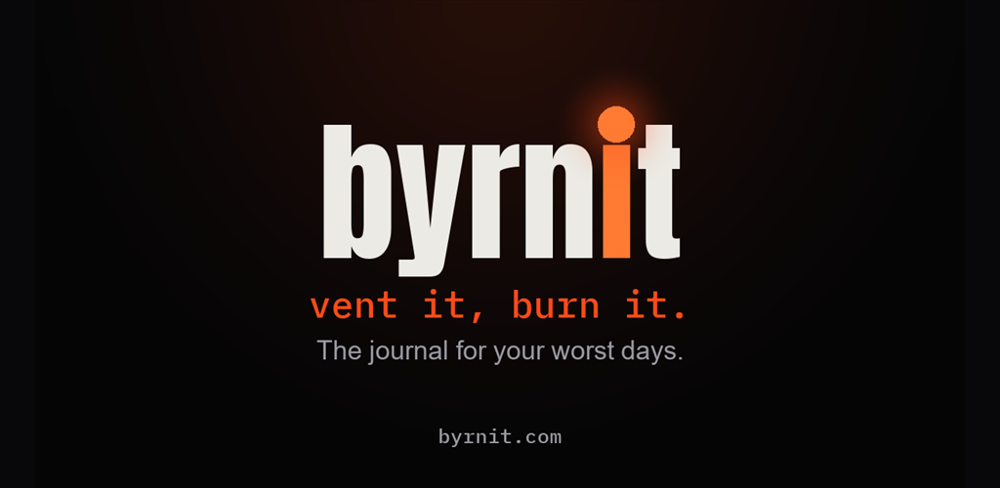
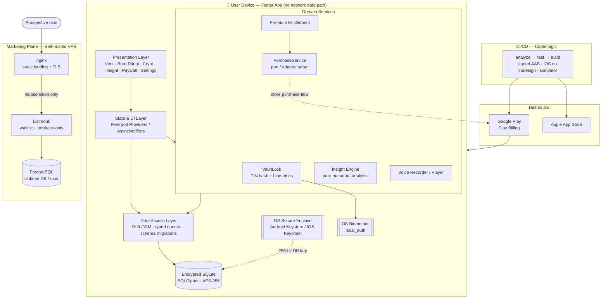
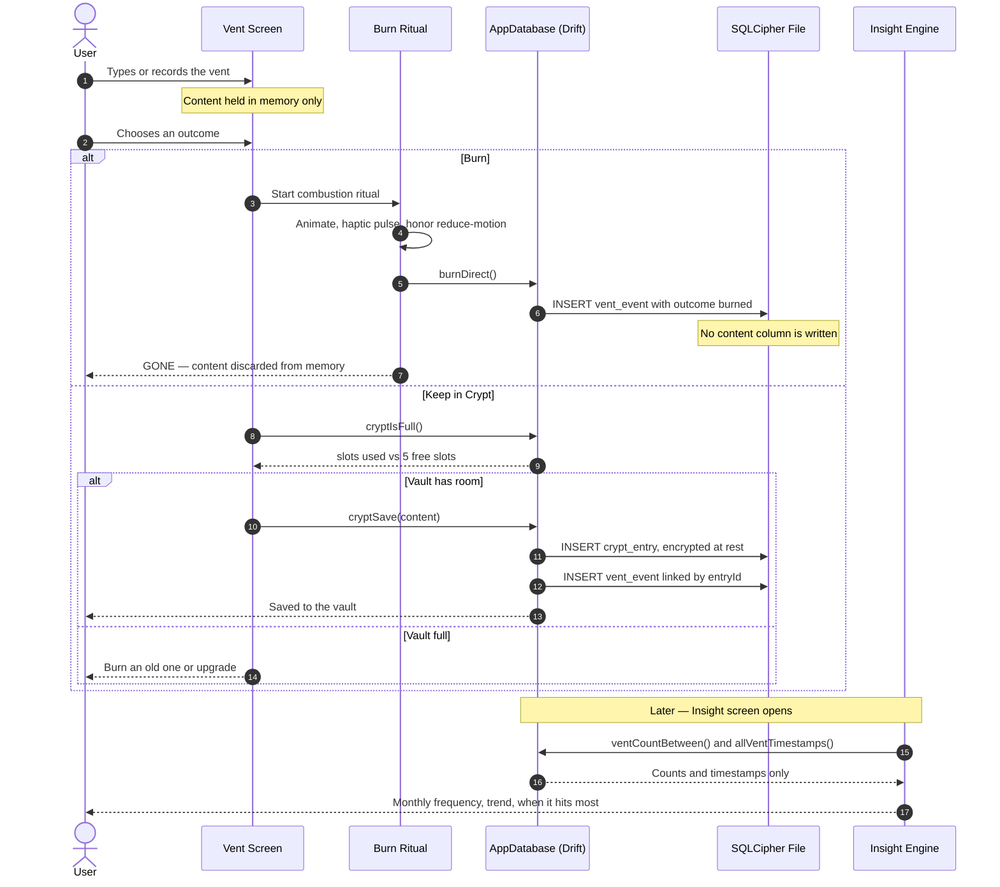
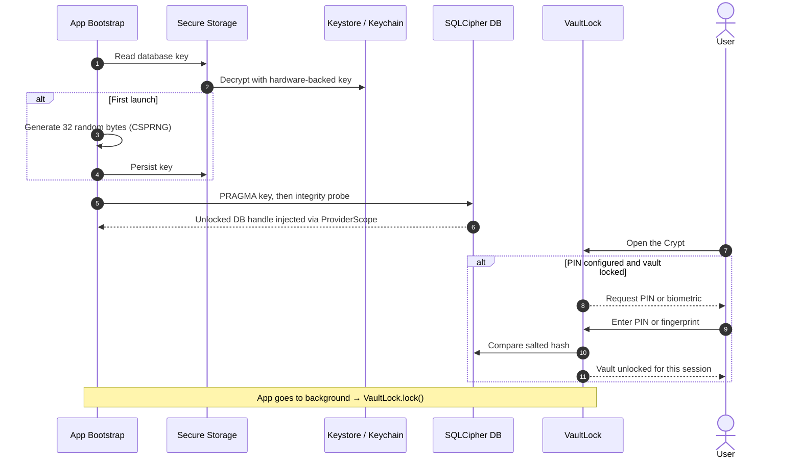

# Byrnit — Vent It, Burn It

> A privacy-first mobile journal for bad days: write or speak the anger, then burn it for good or lock it in an encrypted vault. No cloud, no accounts, and nobody reading it.

An anti-cozy journaling app. No streaks, no gratitude prompts, no soft pastel calm. You write what's actually bothering you, and then you burn it — the entry is gone, on purpose.

Led end to end from brand concept to a live Google Play release: positioning, UX, mobile build, CI/CD, launch assets.

| | |
|---|---|
| **Role** | Product Owner & Solution Architect: product strategy, system design, delivery management and release engineering (AI-augmented delivery model) |
| **Tech Stack** | Flutter 3.38 · Dart 3.10 · Riverpod 3 · Drift ORM · SQLCipher · Codemagic CI |
| **Target Platform** | Android (live) · iOS (CI-verified build, store release pending) |
| **Status / Impact** | **v1.1 in production on Google Play, worldwide** · 0 bytes of user content leave the device · 70+ automated tests gate each release |

### Live Links

| Channel | Link |
|---|---|
| Google Play | [Get it on Google Play](https://play.google.com/store/apps/details?id=com.byrnit.byrnit) |
| App Store | Coming soon |
| Product site & waitlist | [byrnit.com](https://byrnit.com/) |

---

## The Idea: Business Problem & Solution

### The Challenge

Most journaling apps are built around permanence and positivity — keep every entry, build a streak, reflect on growth. That's the right product for some people and the wrong one for anyone who just needs to get something out of their head *right now*, without it becoming a permanent record they'll reread at 2am.

Market research for this project (community listening across Reddit and TikTok) turned up a group the *cozy* apps leave out: **people who need to get rid of anger, not reframe it.** For them:

- **Toxic positivity pushes them away.** They don't want to be told to smile or drink water.
- **Privacy is the main worry.** Users hold back when they suspect a server, an employer or a partner could read what they wrote.
- **Paper is the only real alternative today.** It's private and you can destroy it, but it tells you nothing about your own patterns.

The strategic insight is that incumbents **cannot copy this positioning without breaking their own brand.** A product built for raw anger is a category that a gratitude app can't credibly move into.

### The Solution

Byrnit's core mechanic is deletion as a feature. It is a **local-first, zero-cloud** mobile app built around one catharsis loop:

1. **Vent**: open the app and you're straight in a raw text box, or recording a voice note. No onboarding flow and no prompts.
2. **Decide**:
   - **Burn**: a combustion ritual with animation and haptics, followed by permanent deletion. The content is **never written to disk.**
   - **Crypt**: keep it in an encrypted, PIN- or biometric-locked vault and come back to it later.
3. **Understand**: a **pattern insight** built only from anonymous metadata (frequency, month-over-month trend, "when it hits most"). It works even after everything has been burned.

The result is something paper can't offer: **catharsis now and self-awareness later, without keeping the toxic content.**

---

## From Concept to Store, One Deliberate Stage at a Time

This wasn't "build the app then figure out branding." Each stage shipped as a checkpoint:

1. **Validation** — is "anti-cozy journaling" an actual gap, or just a contrarian idea? Validated against existing cozy-journal competitors before writing a line of UI code.
2. **Brand** — the "vent it, burn it" identity, tone of voice, and visual language, decided before screens were designed so the UX had a personality to be consistent with.
3. **UX** — screen flows built around the one mechanic that matters: write → burn. Everything else stays out of the way of that.
4. **Build** — Flutter app, encrypted local-first storage, no account required to use the core loop. Shipped as thin vertical slices, each with acceptance criteria written up front.
5. **Launch** — store assets, feature graphics, Play Console submission, landing page with its own privacy policy and waitlist. **v1.0 went live, followed by v1.1 (voice notes and Android 15 compliance), now in production worldwide.**

---

## Key Features & Capabilities

**Core experience (free, never paywalled)**
- **Text and voice venting.** Voice notes are recorded as AAC with a hard 3-minute cap and stored as encrypted blobs. The temporary recording file is deleted as soon as it's captured.
- **Burn ritual.** Four randomized combustion styles drawn on a custom canvas, with haptic feedback. Honors the OS "reduce motion" setting. Burning a voice note while it plays cuts the audio instantly.
- **The Crypt (vault).** 5 free slots shared by text and voice. Each saved entry allows one **dated append**, and the original is never edited, so the snapshot of the moment stays intact.
- **Vault lock.** Optional 4-digit PIN (salted hash) plus a biometric shortcut. The vault **auto-locks when the app goes to the background.**
- **Destructive controls with safeguards.** "Empty the vault" and "burn everything" require a typed confirmation.

**Premium layer (freemium, cosmetic and insight features)**
- **Pattern Insight**: monthly frequency, trend against the previous month, and the most frequent weekday and time-of-day pair. It only appears after 3 vents, so it never draws conclusions from almost no data.
- **Outcome breakdown**: burned, kept, and "let go" (saved first, burned later). This is modeled as a state change on the original event, not a duplicate record.
- **Paywall** with lifetime and monthly plans behind a store-agnostic purchase interface.

**Platform quality**
- **Internationalization**: English and Spanish through ARB/gen-l10n, with custom locale resolution (`es-MX`, `es-AR` and similar map to Spanish, and Catalan, Basque and Galician devices fall back to Spanish instead of English).
- **Accessibility**: WCAG 2.1 AA contrast **enforced by automated tests** on the design tokens, and OS text scaling honored within a range that keeps the layout intact.
- **Android 15 compliance**: edge-to-edge rendering and **16 KB memory-page-aligned** native libraries, both required by Google Play.

---

## System Architecture & System Design

### High-Level Architecture

The product has two **deliberately disconnected** planes. The mobile app has **no backend and no network data path**, so all user data lives in an encrypted database on the device. The marketing plane (landing page and waitlist) runs on separate, self-hosted infrastructure and never touches app data.

### Core Data Flow — "Vent → Burn or Keep"

This is the main user action and the privacy promise in practice. The key design rule is that **burned content exists only in memory**. Only a content-free metadata event is written, and that event is what feeds the Insight engine.

### Secure Cold Start & Vault Unlock

---

## Technical Stack & Decision Rationale

| Category | Technologies |
|---|---|
| **Mobile / Frontend** | Flutter 3.38 (toolchain pinned via FVM), Dart 3.10, Material 3 with a custom design-token system, CustomPainter animations, Lucide icons |
| **State Management & DI** | Riverpod 3: `AsyncNotifier` for stateful domains, `StreamProvider` for live vault data, `autoDispose` providers for insight recomputation |
| **Persistence** | Drift ORM (type-safe, code-generated), SQLCipher 4.x (16 KB-aligned native libraries), versioned schema migrations (v1 → v4) |
| **Security** | `flutter_secure_storage` (Keystore/Keychain), `local_auth` (biometrics), `crypto` (SHA-256 with random salt) |
| **Media** | `record` (AAC-LC, 96 kbps), `audioplayers` |
| **Monetization** | Store-agnostic `PurchaseService` interface (Play Billing / RevenueCat adapter slots in without UI changes) |
| **CI/CD** | Codemagic: Android signed AAB → Play internal track; iOS release build without code signing and a simulator build for cloud previews; `flutter analyze` + `flutter test` as blocking gates |
| **Marketing Infrastructure** | Static landing on nginx (Hetzner VPS), Listmonk (Docker) on a shared PostgreSQL instance with an isolated DB and user |
| **Analytics** | No third-party SDK by design; aggregate store metrics only (Play Console) |

### Architectural Decisions

- **Flutter, built mobile-first for Android and iOS from one codebase.** A lean team gets two native platforms from one codebase. The web target was ruled out on purpose because it's Flutter's weakest target and the cause of a previous failed attempt. The iOS risk is handled without Mac hardware by having CI build and test the iOS target on every pipeline run.
- **Local-first with no backend at all, instead of a "privacy-friendly cloud".** The "burn" mechanic requires deletion to actually mean deletion — no server copy to forget about. Privacy is the brand's differentiator, and a promise is only credible if the architecture makes a breach impossible rather than just unlikely. Dropping the backend also means **no server cost, no GDPR data-processor exposure and no auth system to maintain**.
- **Full-database encryption (SQLCipher) instead of field-level encryption.** Encrypting the whole file protects text, voice blobs and metadata alike, so no column can be accidentally left in plaintext. The 256-bit key is generated on the device and held in hardware-backed OS storage, never next to the data.

---

## Engineering Highlights & Security Standards

### Patterns & Practices

- **Layered architecture.** Presentation, state/DI, domain services and data access are separated, so each layer only depends on the one below it.
- **Repository-style data access.** One typed database class holds the **write rules** (for example "burn never persists content" and "an original entry is immutable, append-only"), so the rules can't be bypassed from the UI.
- **Ports & Adapters for monetization.** The paywall and entitlement logic depend on a `PurchaseService` interface. A development adapter lets the full purchase flow be tested before store products exist, and the production billing provider plugs in without UI changes.
- **Pure, deterministic domain logic.** The Insight engine is a set of side-effect-free functions over counts and timestamps. It's language-neutral (it returns stable keys that the UI localizes) and fully unit-tested, with deterministic tie-breaking.
- **Dependency injection for testability.** The encrypted database is injected at the root `ProviderScope`, and tests replace it with an in-memory database, so business rules are tested against a real SQL engine.
- **Vertical slices and TDD.** Features shipped as thin end-to-end slices (Crypt → Lock → Insight → Paywall → Settings), each with **verifiable acceptance criteria** written up front.
- **Non-destructive schema evolution.** Four schema versions shipped with in-place migrations (including a table rebuild to add voice support) that **keep existing users' data**.
- **Design system as code.** Colors, type and motion live in central tokens that mirror the written style guide, and an automated test checks WCAG AA contrast on the palette.
- **Release engineering.** The toolchain is pinned, lint and tests block every build, signing keys are held as encrypted CI secrets, and Google Play platform requirements (16 KB page alignment, edge-to-edge, target SDK) were found and fixed before they could block a release.

### Security & Privacy Posture

- **Encryption at rest.** The whole local database is encrypted with SQLCipher, using a device-generated 256-bit key held in the **Android Keystore / iOS Keychain**.
- **Data minimization by construction.** Burned content is **never written to storage**; only a content-free event (a timestamp and an outcome) is kept. Voice recordings go through a temporary file that is deleted as soon as it's captured.
- **Credential hygiene.** Vault PINs are stored only as salted SHA-256 hashes. Biometrics use the OS authenticator, so no biometric data ever reaches the app. The vault re-locks when the app goes to the background.
- **Backup-leak prevention.** OS cloud backup is turned off for the app, because a restored database without its hardware-bound key would be unreadable. Turning it off also keeps encrypted user data out of third-party backup storage.
- **Zero telemetry of content.** There's no analytics SDK and no crash-reporting payloads carrying user data. Product metrics come only from aggregate store dashboards.
- **Hardened marketing infrastructure.** The waitlist service binds to loopback only, the reverse proxy exposes a single subscription endpoint, the admin panel is **reachable only through an SSH tunnel**, and database credentials are isolated per service.

---

## Why This Is in the Portfolio

Every other project here is client or team work inside an existing system. This one is the opposite proof point: taken from "is this idea worth building" to an app live in production, including the parts that aren't code — positioning, visual identity, security architecture, release logistics.

---

## Portfolio & Intellectual Property Notice

This repository is an **architectural case study**. It includes the brand and UX narrative, system design and store assets. The production `lib/` source, the app-signing keystore, store configuration, infrastructure secrets and unfiltered strategy notes remain **private and proprietary** and are protected by intellectual-property and confidentiality obligations.

Engineering leaders, founders or prospective clients who would like a deeper technical walkthrough (architecture review, code samples under NDA, or a discussion of how this delivery model applies to their product) are welcome to get in touch.

**[Book a meeting](https://calendar.app.google/5FeUeC4X1VBYt2bU6)** · [eugeniozamora.com](https://eugeniozamora.com) · [LinkedIn](https://www.linkedin.com/in/eugeniozamora/) · [GitHub](https://github.com/eugeniozamora)

---

© 2026 Byrnit. All rights reserved. Byrnit and the Byrnit logo are trademarks of their respective owner.
